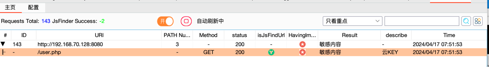
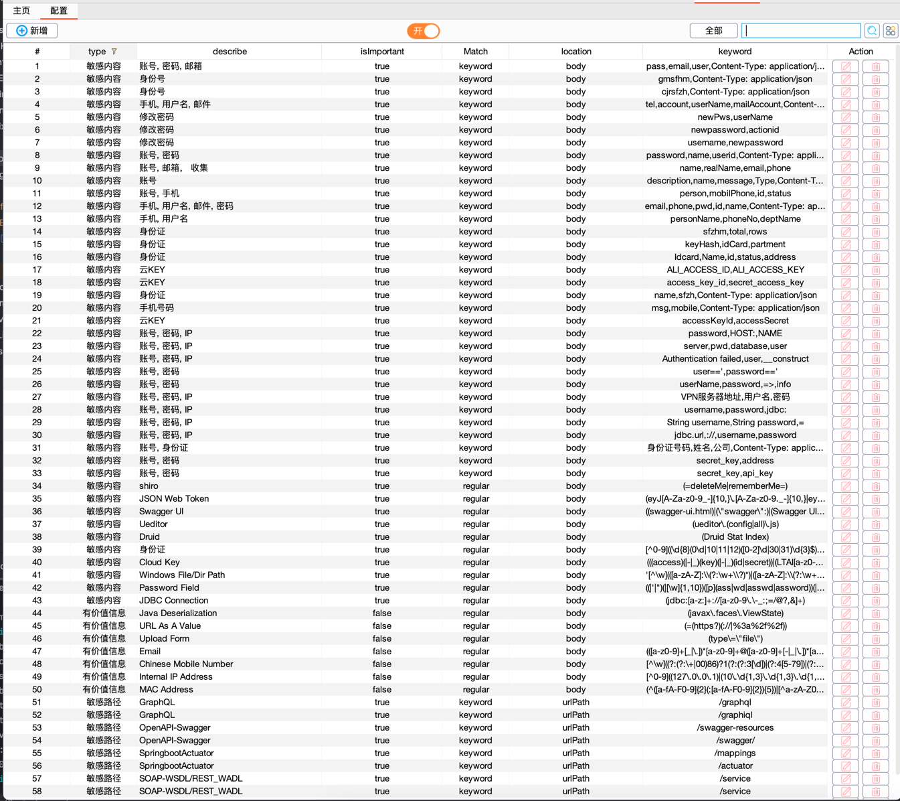
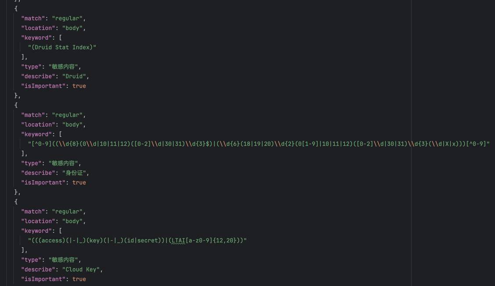
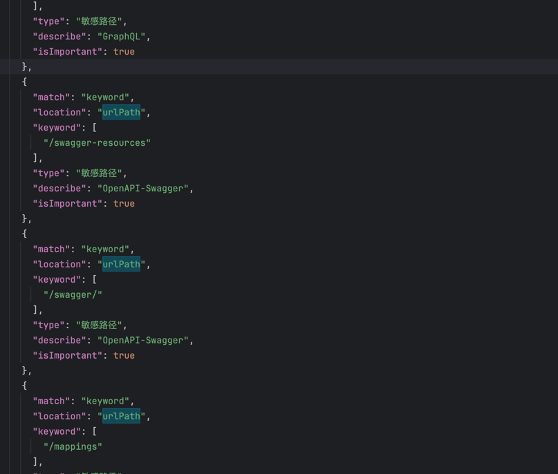
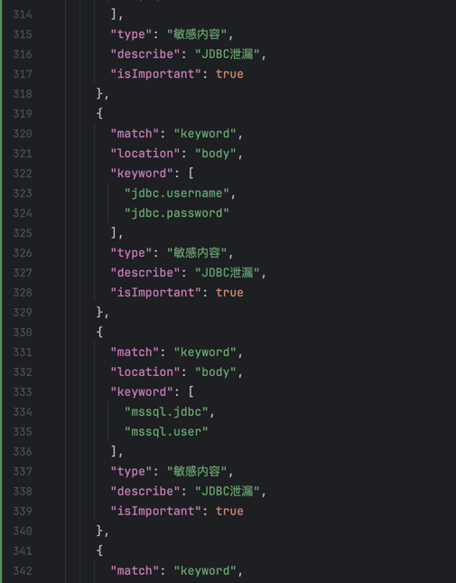

# BurpAPIFinder

> 攻防演练过程中，我们通常会用浏览器访问一些资产，但很多未授权/敏感信息/越权隐匿在已访问接口过html、JS文件等，通过该BurpAPIFinder插件我们可以：  
> 1、发现通过某接口可以进行未授权/越权获取到所有的账号密码、私钥、凭证  
> 2、发现通过某接口可以枚举用户信息、密码修改、用户创建接口  
> 3、发现登陆后台网址  
> 4、发现在html、JS中泄漏账号密码或者云主机的Access Key和SecretKey  
> ...  

## 功能如下
> 如果有更好的建议或者期待使用的，点个免费的Star
- [x] 提取网站的URL链接和解析JS文件中的URL链接
- [x] 前段界面可自行定义敏感关键词、敏感url匹配
- [x] 界面可配置的开启主动接口探测、敏感信息获取
- [x] 集成主流攻防场景敏感信息泄漏的指纹库  

- [x] 集成HaE的敏感信息识别指纹  

- [x] 集成APIKit的敏感信息识别指纹  

- [x] 集成sweetPotato的敏感信息识别指纹  

## 使用说明
1、下载右侧Releases下的jar包  
2、如原先有使用旧版本的，需要删除掉原先同BurpAPIFinder.jar同目录下的BurpAPIFinder.db文件后再加载

## 闲聊/优化/建议/问题反馈群

## BurpFingerPrint
额外推荐笔者另一个好用的插件 BurpFinderPrint
GITHUB: https://github.com/shuanx/BurpFingerPrint
该插件为作者精心开发出来, 旨在打造最强免费指纹识别库和弱口令探测库

## 免责声明

本工具仅作为安全研究交流，请勿用于非法用途。如您在使用本工具的过程中存在任何非法行为，您需自行承担相应后果，本人将不承担任何法律及连带责任。
